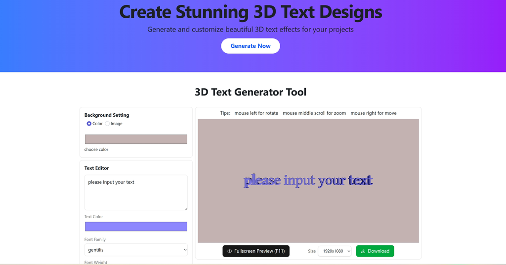

# Fast3DText

[](https://fast3dtext.com)
An online **3D text generator** that allows you to create beautiful 3D lettering in your browser.
No installation required — just open and start creating!

## ✨ Features

- 🎨 **3D Text Creation** — Type your text and instantly see it in 3D.
- 🖌 **Customizable Styles** — Change fonts, colors, gradients, background, and more.
- 🖼 **Export Options** — Save your design as PNG, JPG, or GLB for 3D use.
- 📂 **Custom Fonts Support** — Upload your own font files (JSON from facetype.js).
- 🌐 **No Signup Needed** — Everything runs in your browser.
- 🚀 **Fast and Lightweight** — Built with WebGL / Three.js for smooth rendering.

## 🖼 Screenshots



## 🌍 Live Demo

Visit: **[https://fast3dtext.com](https://fast3dtext.com)**

## 🛠 Tech Stack

- **Frontend**: React, Three.js, TypeScript
- **Rendering**: WebGL, Three.js TextGeometry
- **Build Tool**: Vite / Next.js (update with your actual stack)

## 📦 Installation

Clone the repo:

```bash
git clone https://github.com/wms-why/fast3dtextonline.git
cd fast3dtextonline
```
